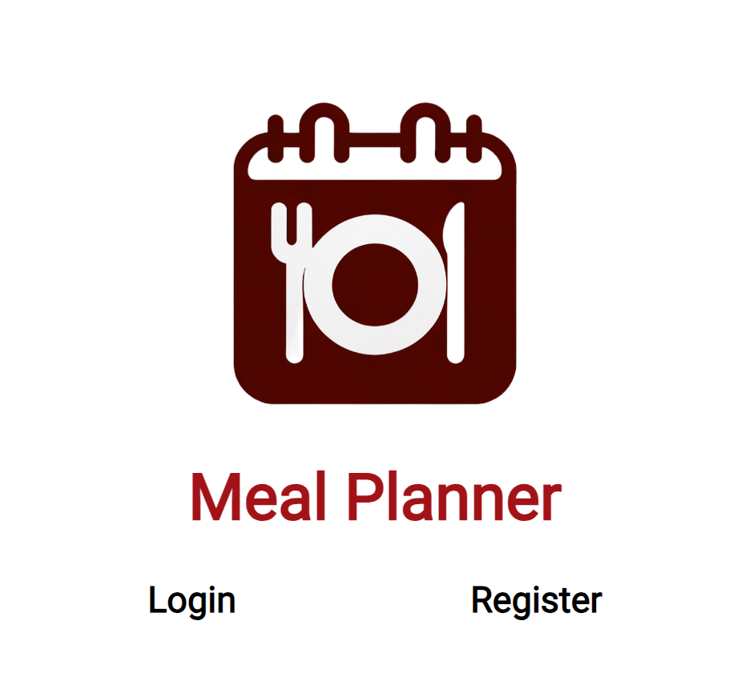
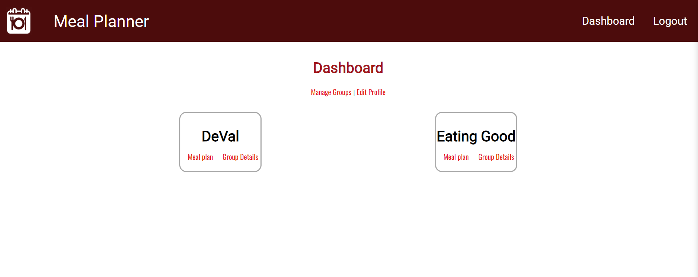
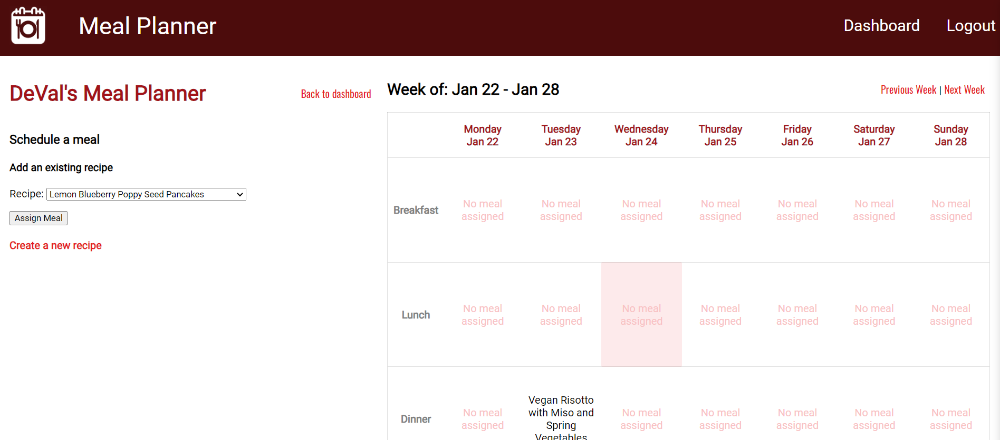
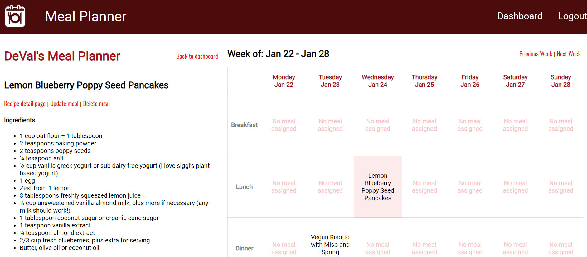

# Meal Planner
Plan meals with your household. Create recipes and share them with the rest of your household. This app will keep help keep you up with what's cooking in the kitchen for breakfast lunch and dinner.
Sign up for an account and invite members of your household to a new group, or join an existing group.

# Screenshots
Homepage

Dashboard

Calendar - Schedule a recipe

Calendar - Recipe schedules

# Technologies Used
- Python
- Django
- CSS
- HTML

# Getting Started
[Deployment](https://mealplanner-deploy-69aff832caa7.herokuapp.com/)
[Trello Board](https://trello.com/b/uFYfYMrn/sei-project-4-meal-planner)

# Current Features
- Login/Register
- Join an existing group or create a new group
- Plan meals in a calendar - create, update, delete meals
- Create, update, and delete recipes for your group
- Update, and delete your groups, or leave them
- Update and delete profile

# Next Steps
1. Change password
2. Implement a web scraper that will automatically provide the recipe details from a recipe link
3. Integrate Google Calendar
4. Create a shopping list from ingredients needed
